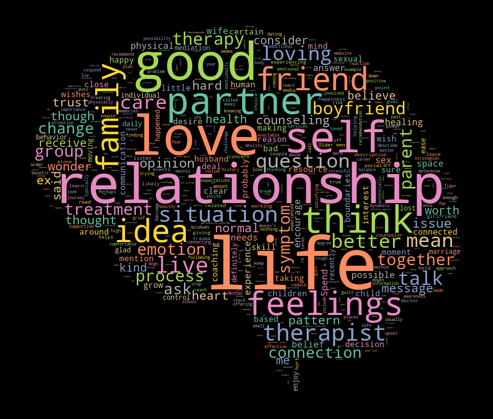

# Fine-Tune ChatGPT 3.5 Turbo

## Introduction
In this project I have fine-tuned ChatGPT on [counsel chat data](https://github.com/nbertagnolli/counsel-chat/tree/master/data). Counsel chat is a platform to help counselors build their reputation and make first contact with potential clients. It's an interaction similar to forums, where the user introduces a discussion and therapists can respond.

The goal of this project was to see if I could change the tone of ChatGPT response as [pointed out](https://openai.com/blog/gpt-3-5-turbo-fine-tuning-and-api-updates) by OpenAI.

## Results

The fine-tuned process indeed modified the tone of the responses, as you can see in the file [test_data.txt](output/test_data.txt). While the base chatgpt-3.5-turbo often began a sentence with some generic empathetic message like: "I'm really sorry to hear that..." or "I'm sorry to hear about...". The fine-tuned model is way more versatile, it's really sound like the responses it was trained on. In defense of base ChatGPT, I modified the system prompt to explicitly request it to play the role of a counselor "with a lot of empathy". I choose to do it this way since it was the same system message used in the fine-tune process.

The fine-tuned process also affected the length of responses. The actual responses have an average length of 166 words, while the base GPT had an average of 225 words and the fine-tune model had an average of 173 words on the test set, closer to the actual responses average length. Keep in mind that I had set max_tokens to 300, which means that base gpt could have had an even more disparate average length.

The way the responses were formatted was also affected. While base chatGPT use more newline characters and frequently creates numbered lists in its responses. The fine-tuned model does not use newline characters or create numbered lists, matching the format in the training dataset.
